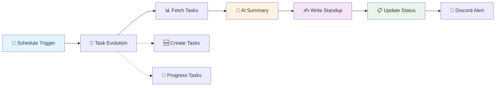

# Notion of Progress

[](https://github.com/elpic/notion-of-progress/actions/workflows/integration.yml)
[](https://github.com/elpic/notion-of-progress/actions/workflows/daily-standup.yml)
[](https://github.com/elpic/notion-of-progress/actions/workflows/weekly-digest.yml)

> **AI-powered standup automation that never misses a beat.** Claude reads your tasks every morning, generates intelligent summaries, and writes beautifully formatted standup pages directly into Notion — completely hands-free.

## 🔥 **[LIVE SYSTEM DASHBOARD](https://pablo-ifran.notion.site/Notion-of-Progress-323de7d1d23880c89234f2e705e1b938?source=copy_link)** 🔥

**Watch the AI agent breathe in real-time** → The only submission where Notion *is* the monitoring dashboard. Click to see live operational status, execution history, and system health metrics updating automatically.

---

<div align="center">

[](https://www.youtube.com/watch?v=36WeQq2UOaA)

**🎬 [Watch the Demo Video](https://www.youtube.com/watch?v=36WeQq2UOaA)**

</div>

---

## ✨ What Makes This Special

### 🤖 **Intelligent Task Evolution**
Every day, the system doesn't just read your tasks—it **evolves your project**:
- **Generates realistic new tasks** based on current project context (Features, Bugs, Infrastructure, Documentation)
- **Progresses existing tasks** through natural lifecycles (To Do → In Progress → Done/Blocked)
- **Simulates authentic development patterns** with sprint-like workflows and priorities
- **60+ task templates** covering real software engineering scenarios

### 🧠 **AI-Powered Standup Generation**
Using **Notion MCP** and **Claude Sonnet**, the system:
- **Autonomously navigates** your Notion workspace via MCP tools
- **Intelligently decides** whether to create new pages or update existing ones
- **Writes beautifully formatted content** with callouts, links, and rich formatting
- **Handles edge cases gracefully** with comprehensive error recovery

### 📊 **Self-Monitoring Dashboard**
The AI agent **monitors itself** and maintains a live operational dashboard:
- 🟢 **Real-time system status** (Operational/Degraded/Down)
- ⏰ **Live execution timestamps** (see it breathing)
- 📈 **Cumulative metrics** (total standups, success rate, uptime)
- 🎯 **Execution details** (Local runs vs GitHub Actions)
- 🚨 **Error tracking** with detailed failure analysis

### 🔄 **Complete Automation**
- **GitHub Actions workflows** run daily standups and weekly digests
- **Zero manual intervention** required once configured
- **Discord notifications** keep your team in the loop
- **Idempotent operations** safe to run multiple times

---

## 🏗️ How It Works



### The Architecture Story

```
┌─────────────────────────────────────────────────────────────────────┐
│                        Notion of Progress                            │
│                                                                     │
│  1. Evolve Tasks   2. Fetch Data     3. AI Analysis   4. Write Page │
│  ─────────────     ─────────────     ────────────     ──────────── │
│  TaskEvolution →   Notion APIs   →   Claude Sonnet →  Notion MCP   │
│  (Context-aware    (Typed client     (4.6 + Agent    (Autonomous   │
│   generation)      + Retry logic)     SDK)           navigation)   │
│                                                              │       │
│                        5. Self-Monitor        6. Notify     ↓       │
│                        System Status         Discord       Dashboard │
└─────────────────────────────────────────────────────────────────────┘
```

**The key innovation:** Instead of hardcoded API calls, a **Claude agent autonomously navigates Notion** via MCP tools, making intelligent decisions about page creation, content structure, and formatting in real-time.

---

## 🎯 Core Features

### 📝 **Generated Standup Pages**
Every standup is beautifully formatted with:

| Section | Content | Visual |
|---------|---------|--------|
| 📊 **Summary** | `3 completed · 4 active · 1 blocker` | Color-coded status callout |
| ✅ **Yesterday** | Linked bullet points to completed tasks | Green success indicators |
| 🔨 **Today** | Active work items with Notion links | Progress callouts |
| 🚧 **Blockers** | Highlighted blockers with context | Red warning callouts |

### 🎨 **Rich Visual Formatting**
- **Random emoji icons** on every page for personality
- **Color-coded callouts** for different content types  
- **Direct task links** back to source Notion pages
- **Professional typography** with consistent styling
- **Responsive blocks** that work on mobile and desktop

### 🎲 **Dynamic Task Scenarios**
The system creates realistic software development scenarios:

**Feature Development:**
- Implement OAuth 2.0 authentication
- Build real-time notification system
- Add dark mode toggle to preferences
- Create advanced search with filters

**Bug Fixes:**
- Fix memory leak in WebSocket connections
- Resolve race condition in async data fetching
- Correct timezone handling in date picker
- Resolve infinite scroll pagination bug

**Infrastructure:**
- Migrate database to PostgreSQL 15
- Implement Redis caching layer
- Configure monitoring and alerting
- Set up automated backup strategy

**Documentation & Refactoring:**
- Write API documentation for v2 endpoints
- Refactor authentication middleware
- Update deployment runbooks
- Extract utilities into shared library

---

## 🚀 Quick Start

### **1. Prerequisites**

- **Node.js 18+** (managed via [mise](https://mise.jdx.dev))
- **Notion workspace** with integration permissions
- **Anthropic API key** for Claude access

### **2. Installation**

```bash
git clone https://github.com/elpic/notion-of-progress
cd notion-of-progress
npm install
# or: mise run install
```

### **3. Configuration**

```bash
# Copy example environment
cp .env.example .env
```

**Get your API keys:**
1. **Notion Integration**: [notion.so/my-integrations](https://www.notion.com/my-integrations)
2. **Anthropic API**: [console.anthropic.com/settings/keys](https://console.anthropic.com/settings/keys)

Add them to `.env`:
```env
NOTION_API_KEY=secret_...
ANTHROPIC_API_KEY=sk-ant-...
```

### **4. Automated Setup**

```bash
mise run setup
```

**The setup script automatically:**
- ✅ Creates Notion databases (Tasks, Standup Log, System Status)
- ✅ Generates live system monitoring dashboard
- ✅ Configures GitHub repository secrets for automation
- ✅ Provides testing instructions and next steps

> 💡 **Pro tip:** Before setup, create an empty Notion page and connect your integration: **Page menu (···) → Connections → Add your integration**

### **5. First Run**

```bash
# Generate your first standup
mise run standup

# Watch the AI think (verbose mode)  
mise run standup -- --verbose

# Preview without writing (dry run)
mise run standup -- --dry-run
```

### **6. Enable Automation** (Optional)

For automated daily standups, configure GitHub Actions:
1. Push your code to GitHub
2. The setup script configures repository secrets automatically
3. Workflows run daily at 8 AM EST and weekly digests on Fridays

---

## 🛠️ Commands Reference

### **Core Operations**
```bash
# Standup generation
mise run standup                    # Generate today's standup
mise run standup -- --verbose       # Watch AI reasoning in real-time
mise run standup -- --dry-run       # Preview without writing to Notion

# Task evolution
mise run evolve-tasks               # Generate new tasks, progress existing ones
mise run evolve-tasks -- --dry-run  # Preview task changes
mise run evolve-tasks -- --verbose  # Detailed evolution logging

# Weekly reporting
mise run digest                     # Generate weekly digest
mise run digest -- --week -1        # Generate last week's digest
```

### **Development & Testing**
```bash
# Quality assurance
mise run test                       # Run test suite
mise run typecheck                  # TypeScript validation
mise run setup                     # Complete system setup

# Local scheduling
mise run start                      # Start local scheduler (8 AM weekdays)
```

### **Manual Operations**
```bash
# Direct npm commands (if you prefer)
npm run standup
npm run digest
npm run evolve-tasks
npm run setup
```

---

## ⚙️ Configuration

### **Environment Variables**

| Variable | Required | Default | Description |
|----------|----------|---------|-------------|
| `NOTION_API_KEY` | ✅ **Required** | — | Notion internal integration token |
| `ANTHROPIC_API_KEY` | ✅ **Required** | — | Anthropic API key for Claude |
| `NOTION_TASK_DB_ID` | 🤖 **Auto-generated** | — | Task database ID (created by setup) |
| `NOTION_STANDUP_LOG_DB_ID` | 🤖 **Auto-generated** | — | Standup log database ID |
| `NOTION_SYSTEM_STATUS_DB_ID` | 🤖 **Auto-generated** | — | System status dashboard ID |
| `DISCORD_WEBHOOK_URL` | 🔧 *Optional* | — | Discord channel webhook for notifications |

### **Scheduler Configuration** (Local runs only)
| Variable | Default | Description |
|----------|---------|-------------|
| `CRON_SCHEDULE` | `0 8 * * 1-5` | Daily standup schedule (weekdays 8 AM) |
| `DIGEST_CRON_SCHEDULE` | `0 17 * * 5` | Weekly digest schedule (Fridays 5 PM) |
| `TZ` | `America/New_York` | Timezone for local scheduler |

### **Notion Database Customization**
| Variable | Default | Description |
|----------|---------|-------------|
| `TASK_STATUS_PROPERTY` | `Status` | Name of status property in Task DB |
| `TASK_DONE_VALUE` | `Done` | Status value meaning "completed" |
| `TASK_TITLE_PROPERTY` | `Name` | Name of title property in Task DB |

---

## 🏛️ Architecture Deep Dive

### **Clean Architecture Principles**
Built on **Ports and Adapters** (Hexagonal Architecture):

```
src/
├── core/                           # 🏛️ Domain Logic (Framework Independent)
│   ├── domain/
│   │   └── types.ts               # Core types and interfaces
│   ├── ports/                     # Interface contracts
│   │   ├── TaskRepository.ts      # Task data access interface
│   │   └── SummaryGenerator.ts    # AI summary generation interface
│   └── standup.ts                 # 🎯 Core business logic
│
├── adapters/                       # 🔌 External System Integrations
│   ├── notion/                    # Notion API integrations
│   │   ├── NotionTaskRepository.ts    # Task DB operations
│   │   └── NotionStandupRepository.ts # Standup page creation
│   ├── claude/
│   │   └── ClaudeSummaryGenerator.ts  # Direct Claude API calls
│   ├── mcp/                       # Model Context Protocol
│   │   ├── McpStandupAgent.ts         # Claude Agent + Notion MCP
│   │   └── McpDigestAgent.ts          # Weekly digest generation
│   └── discord/
│       └── DiscordNotifier.ts         # Team notifications
│
├── services/                       # 🎯 Application Services
│   └── TaskEvolution.ts          # Intelligent task generation
│
└── utils/                          # 🛠️ Shared Utilities
    ├── systemStatus.ts            # Live dashboard management
    ├── retry.ts                   # Resilient API calls
    ├── logger.ts                  # Structured logging
    └── dateHelpers.ts             # Date/time utilities
```

### **Key Design Decisions**

🎯 **Ports and Adapters**: Core business logic has zero dependencies on external frameworks  
🔄 **Dependency Inversion**: High-level modules don't depend on low-level modules  
🛡️ **Error Boundaries**: Comprehensive error handling with graceful degradation  
🔁 **Retry Logic**: Resilient operations with exponential backoff  
📊 **Observable**: Self-monitoring with detailed operational metrics  
🧪 **Testable**: Clean separation enables comprehensive unit testing  

---

## 🔌 Integrations

### **Discord Notifications**
Automatically notify your team when standups are generated:

```env
DISCORD_WEBHOOK_URL=https://discord.com/api/webhooks/...
```

**Features:**
- Rich embedded messages with standup summary
- Color-coded status indicators  
- Direct links to Notion pages
- Automatic retry on webhook failures

### **GitHub Actions Automation**
Fully automated standups with zero maintenance:

**Daily Standup Workflow:**
- Triggers weekdays at 8 AM EST
- Evolves project tasks realistically
- Generates and posts standup
- Updates system monitoring dashboard
- Sends Discord notification

**Weekly Digest Workflow:**
- Triggers Fridays at 5 PM EST
- Aggregates week's progress
- Creates comprehensive weekly summary
- Archives completed work

### **Notion Integration**
Deep integration with Notion's ecosystem:

- **Task Database** syncs with "My Tasks" widget
- **Rich formatting** with callouts, links, and blocks
- **Database properties** fully customizable
- **MCP navigation** enables autonomous content creation

---

## 🚦 System Monitoring

### **Live Dashboard Features**
The system maintains a real-time operational dashboard in Notion:

**Operational Metrics:**
- 🟢 System status (Operational/Degraded/Down)
- ⏰ Last execution timestamp with timezone
- 📊 Total standups generated (cumulative counter)
- 🏗️ Infrastructure details (Local/GitHub Actions)
- 📈 Success rate and uptime tracking

**Error Tracking:**
- 🚨 Detailed error messages and stack traces
- 🔄 Retry attempt logging
- 📋 Recovery action recommendations
- 🕐 Error timestamp and environment context

**Evolution Metrics:**
- 📝 Tasks created per evolution cycle
- 🔄 Tasks progressed through lifecycle
- ✅ Tasks completed and success patterns
- 🧮 Project velocity calculations

### **Health Checks**
The system continuously monitors:
- API connectivity (Notion, Anthropic, Discord)
- Database accessibility and schema validation
- MCP server communication
- GitHub Actions workflow status

---

## 🧪 Testing & Quality Assurance

### **Test Coverage**
```bash
mise run test              # Run full test suite
mise run test -- --watch   # Watch mode for development
mise run typecheck         # TypeScript validation
```

**Testing Strategy:**
- ✅ **Unit Tests**: Core business logic and utilities
- ✅ **Integration Tests**: External API interactions
- ✅ **Type Safety**: Comprehensive TypeScript coverage
- ✅ **Error Scenarios**: Edge case and failure handling
- ✅ **Idempotency**: Safe retry and repeat operations

### **Code Quality Tools**
- **TypeScript**: Strict type checking with comprehensive interfaces
- **ESLint**: Code style and pattern enforcement
- **Prettier**: Automated code formatting
- **Vitest**: Fast unit testing framework
- **GitHub Actions**: Continuous integration pipeline

---

## 🔧 Development

### **Local Development Setup**
```bash
# Clone and install
git clone https://github.com/elpic/notion-of-progress
cd notion-of-progress
mise install              # Install Node.js and tools
mise run install          # Install npm dependencies

# Configure environment
cp .env.example .env      # Add your API keys
mise run setup            # Create Notion databases

# Development workflow
mise run test             # Run tests
mise run typecheck        # Type checking
mise run standup -- --dry-run  # Test standup generation
```

### **Contributing Guidelines**

1. **Branch Naming**: `feat/feature-name`, `fix/bug-name`, `docs/update-name`
2. **Commit Messages**: Follow conventional commits format
3. **Code Style**: Run `mise run typecheck` before committing
4. **Testing**: Add tests for new features
5. **Documentation**: Update README for user-facing changes

### **Project Structure Conventions**
- **`src/core/`**: Framework-independent business logic
- **`src/adapters/`**: External system integrations
- **`src/utils/`**: Shared utilities and helpers
- **`scripts/`**: Command-line tools and automation
- **`docs/`**: Additional documentation

---

## 📚 Additional Documentation

### **Deep Dive Guides**
- [Architecture Overview](docs/architecture.md) - System design and patterns
- [Discord Integration](docs/integrations/discord.md) - Team notification setup
- [Task Evolution System](docs/task-evolution.md) - AI task generation details
- [Troubleshooting Guide](docs/troubleshooting.md) - Common issues and solutions

### **API References**
- [Core Types](src/core/domain/types.ts) - TypeScript interfaces and types
- [MCP Integration](docs/mcp-integration.md) - Model Context Protocol usage
- [System Status API](docs/system-status.md) - Monitoring and health checks

---

## 🎯 Built For

**[DEV.to Notion MCP Challenge](https://dev.to/challenges/notion-2026-03-04)** — March 2026

This project showcases the power of **Model Context Protocol (MCP)** for creating intelligent, autonomous AI agents that can navigate and manipulate complex systems like Notion workspaces.

### **Key Innovations Demonstrated**
- 🧠 **Autonomous AI Navigation**: Claude agents making intelligent decisions about content creation
- 🔄 **Context-Aware Task Evolution**: Realistic software development simulation
- 📊 **Self-Monitoring Systems**: AI agents that monitor and report on their own operations
- 🎯 **Clean Architecture**: Production-ready code with proper separation of concerns
- 🚀 **Full Automation**: Zero-touch operation with comprehensive error handling

---

## 🏆 What Makes This Unique

1. **🎭 Living Development Simulation**: Unlike static demos, this creates dynamic, evolving project scenarios that feel authentic

2. **🔍 Complete Transparency**: Watch the AI think and make decisions in real-time with verbose logging and live monitoring

3. **🛡️ Production Ready**: Comprehensive error handling, retry logic, monitoring, and self-healing capabilities

4. **🏗️ Architectural Excellence**: Clean separation of concerns enables easy testing, maintenance, and extension

5. **📊 Self-Documenting**: The system maintains its own operational dashboard, providing immediate insight into performance and health

**This isn't just automation—it's an intelligent, self-aware system that evolves and adapts, providing genuine value while showcasing the future of AI-powered productivity tools.**

---

<div align="center">

**⭐ If this project helps you, please star it on GitHub!**

[🚀 Get Started](#-quick-start) • [📊 Live Dashboard](https://pablo-ifran.notion.site/Notion-of-Progress-323de7d1d23880c89234f2e705e1b938?source=copy_link) • [🎬 Demo Video](https://www.youtube.com/watch?v=36WeQq2UOaA)

</div>